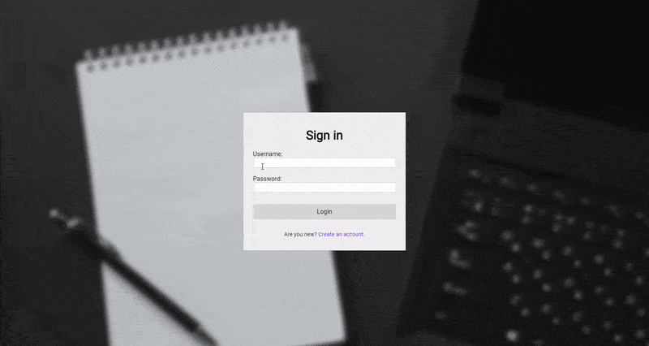

# Private Notes App
Application designed to save and edit your private notes. Created with Angular 11, Express.js and MongoDB. Authentication is based on JSON Web Token.

## Setup
### Runnig frontend
* Install node packages with `npm install`
* Run in locally with `ng serve` or build it with `ng build`
* You can edit API url in `backend.config.ts` file

### Runnig backend
* Install node packages with `npm install`
* Run it with: `node index.js`
* You can edit MongoDB address and JWT options in `.env` file